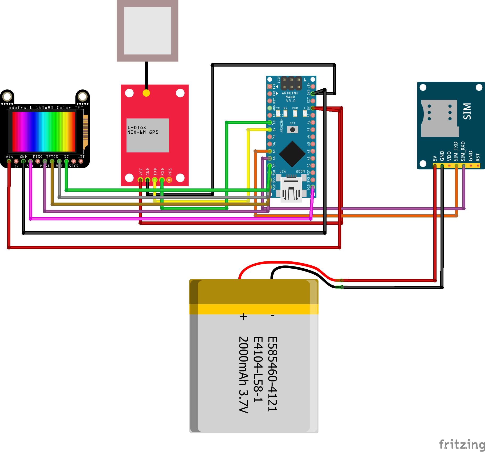

# GPS Tracker with On-Demand SMS Location Sharing

This is a portable GPS location tracker that sends the user's **current location via SMS on request**. It is built around the **Arduino Nano**, **NEO-6M GPS module**, **SIM800L GSM module**, and a **1.14” TFT display**. The device is lightweight, energy-efficient, and powered by a **3.7V Li-Po battery**, making it ideal for tracking pets, people, or assets where live tracking is not necessary.

## Features

- On-demand location tracking using SMS (not continuous/live tracking)
- GPS position acquired using u-blox NEO-6M GPS module
- Sends location via SMS using SIM800L GSM module
- Displays GPS coordinates and system status on a 1.14” TFT ST7789 screen
- Battery-powered for full mobility (3.7V 2000mAh Li-Po)

## Components

| Component                  | Quantity |
|---------------------------|----------|
| Arduino Nano              | 1        |
| NEO-6M GPS Module         | 1        |
| SIM800L GSM Module        | 1        |
| 1.14” TFT ST7789 Display  | 1        |
| 3.7V 2000mAh Li-Po Battery| 1        |
| Jumper Wires              | As needed |

## Wiring Overview

| Module       | Arduino Pin | Function              |
|--------------|-------------|-----------------------|
| TFT VCC      | 5V          | Power                 |
| TFT GND      | GND         | Ground                |
| TFT SCL      | D13         | SPI Clock             |
| TFT SDA      | D11         | SPI Data              |
| TFT RES      | D8          | Reset                 |
| TFT DC       | D9          | Data/Command          |
| TFT CS       | D10         | Chip Select           |
| GPS TX       | D4          | RX for Arduino        |
| GPS RX       | D3          | TX for Arduino        |
| SIM TX       | D7          | RX for Arduino        |
| SIM RX       | D6          | TX for Arduino        |
| SIM VCC      | 5V regulated| Power (with capacitor)|
| SIM GND      | GND         | Ground                |

Note: Ensure that the SIM800L module receives a regulated 4V supply and is capable of handling current peaks of up to 2A.

## How It Works

1. The SIM800L module receives a trigger SMS (e.g., "LOCATION").
2. The Arduino Nano reads the GPS data from the NEO-6M module.
3. The GPS coordinates are:
   - Displayed on the 1.14” TFT screen
   - Sent back to the sender via SMS as a Google Maps link
4. The system is powered via a 3.7V Li-Po battery for portability.

## Setup Instructions

1. Install the required libraries in the Arduino IDE:
   - `Adafruit_GFX`
   - `Adafruit_ST7789`
   - `TinyGPS++`
   - `SoftwareSerial`
2. Upload the `GPS_Tracker.ino` code to your Arduino Nano.
3. Insert a SIM card into the SIM800L module.
4. Power the system using a 3.7V Li-Po battery or a regulated 5V supply.
5. Send an SMS containing the keyword (e.g., `GETLOC`) to the device.
6. Receive a reply SMS with the current GPS coordinates and a Google Maps link.

## Report

Refer to [GPS Tracker - Report.pdf](./GPS%20Tracker%20-%20Report.pdf) for detailed documentation of the system design, implementation, simulations, and technical analysis.

## Future Improvements

- Add a button to request location manually (without SMS)
- Integrate low battery alert via SMS
- Add buzzer or haptic feedback for pet use
- Enable cloud integration for logging coordinates
- Incorporate real-time tracking with a web server (optional extension)

## License

This project is open-source and available under the MIT License.

## Authors

Developed by:
- Anas M. Wagih
- Marwan T. Ghazy

For academic use at Arab Academy for Science, Technology & Maritime Transport (AASTMT).
